# HW1: Projective Geometry and Homography

## Number of late days used - 0

## Q1: Affine Rectification (30 points)

```bash
python main.py -q 1 -c configs/q1_q2.yaml
```

1. **Input Images and Output Images: Rectified images and intermediate images with color coded annotation that you used.**

| Name | Results |
|----- | ------- |
| tiles5 |  |
| facade |  |
| chess1 |  |
| cathedral | 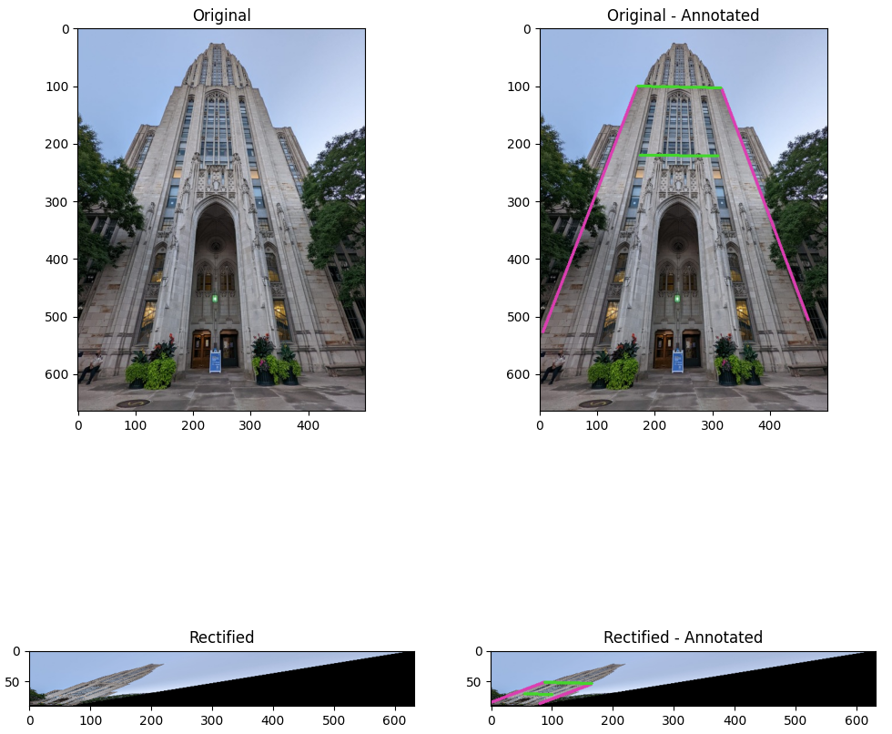 |
| strip |  |

2. **Evaluate Angles (more precisely, the cosines) of at least another 2 pairs of parallel lines before and after rectification.**

| Name | Before | After | Results |
|----- | ------ | ----- | ------- |
| tiles5 | 0.99517, 0.98513 | 0.99998, 0.99999 |  |
| facade | 0.98448, 0.99982 | 0.99996, 0.99999 |  |
| chess1 | 0.937868, 0.99915 | 0.99972, 0.99999 |  |
| cathedral | 0.99855, 0.99622 | 0.99999, 0.99999 | 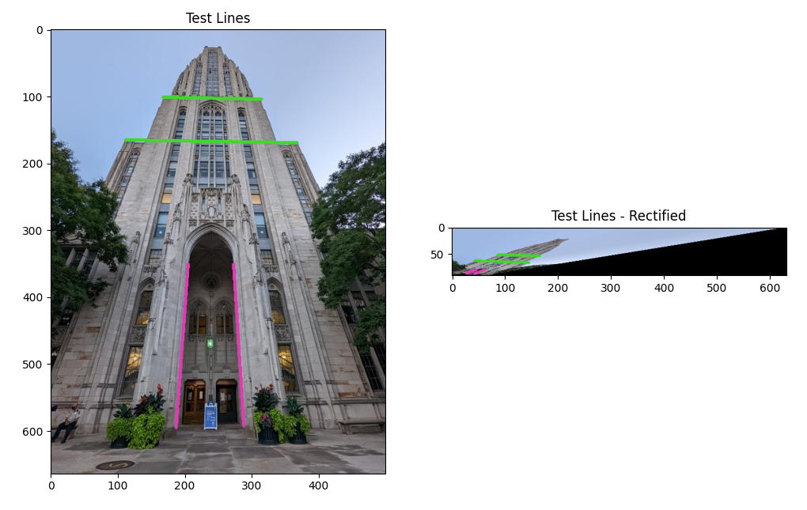 |
| strip | 0.99087, 0.99883 | 0.99992, 0.99999 |  |

3. **Brief description of your implementation (i.e., the algorithm followed with relevant equations and what annotations were used).**

The overall algorithm can be found in the [rectify_to_affinity](q1.py#L23)function. The main logic can be found in the [get_affine_rectification_H](utils/transformation_utils.py#L54) function

Algorithm:

- Find 2 pairs of originally parallel lines in the image
    - These are found by manually annotating 2 points for each line.
    - The pixel coordinates are then stored and a column of ones is added to move it to $\mathbb{P}^2$ space.
    - The corresponding lines are found by taking the cross product of the points.
- Find where the points of intersection for each of these pairs
    - These would be calculated using  $p_1^` = l_{11}^` \times l_{12}^`$, $p_2^` = l_{21}^` \times l_{22}^`$
- Find the line passing through these points. That would give the imaged line at infinity.
    - $l_{\infty}^` = p_1^` \times p_2^`$
- Since we want to find a transformation such that $l_{\infty} = \mathbf{H}^{-T}l_{\infty}^`$ where $l_{\infty} = [0, 0, 1]^T$ and $l_{\infty}^` = [l_1, l_2, l_3]^T$
    - Thus, $\mathbf{H} = \begin{bmatrix}1 & 0 & 0 \\ 0 & 1 & 0 \\ l_1 & l_2 & l_3 \end{bmatrix}$
- Use this to warp the original image back to an affinity.

---
---

## Q2: Metric Rectification (40 points)

```bash
python main.py -q 2 -c configs/q1_q2.yaml
```

1. **Input Images and Output Images: Rectified images and intermediate images with color coded annotation that you used.**

| Name | Results |
|----- | ------- |
| tiles5 |  |
| facade |  |
| chess1 |  |
| cathedral |  |
| strip |  |

2. **Evaluate Angles (more precisely, the cosines) of at least another 2 pairs of perpendicular lines before and after rectification.**

| Name | Before | After | Results |
|----- | ------ | ----- | ------- |
| tiles5 | -0.1543, -0.0235 | -0.00035, 0.00052 |  |
| facade | 0.3917, -0.01043 | 0.00035, 0.00004 |  |
| chess1 | -0.1248, 0.1594 | 0.00095, 0.00432 |  |
| cathedral | 0.1221, -0.0311 | 0.0007, 0.0002 |  |
| strip | 0.0371, 0.0733 | 0.0003, 0.0005 | 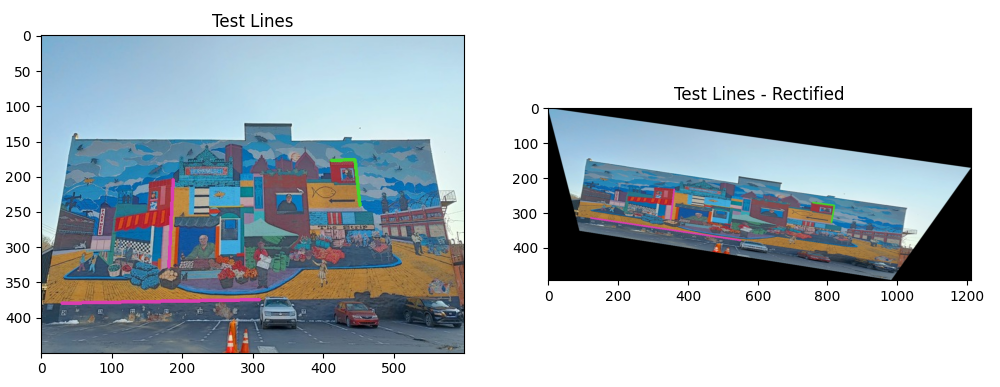 |

3. **Brief description of your implementation (i.e., the algorithm followed with relevant equations and what annotations were used).**

The overall algorithm can be found in the [rectify_to_similarity](q2.py#L26)function. The main logic can be found in the [get_similarity_rectification_H](utils/transformation_utils.py#L15) function

Algorithm:

- Using the algorithm mentioned in the first question, get the image to an affinity.
- Now, find 2 pairs of originally perpendicular lines in the image
    - These are found by manually annotating 2 points for each line.
    - The pixel coordinates are then stored and a column of ones is added to move it to $\mathbb{P}^2$ space.
    - The corresponding lines are found by taking the cross product of the points.
- For a pair of perpendicular lines, say, $l$ and $m$.
    - $l^TC^*_{\infty}m = 0$
    - $(l^{`T}\mathbf{H}_a)C^*_{\infty}(\mathbf{H}_a^Tm^`) = 0$
    - $l^{`T}\begin{bmatrix} A & 0 \\ 0 & 1 \end{bmatrix}\begin{bmatrix} I & 0 \\ 0 & 0 \end{bmatrix}\begin{bmatrix} A^T & 0 \\ 0 & 1 \end{bmatrix}m^` = 0$
    - $l^{`T}\begin{bmatrix} AA^T & 0 \\ 0 & 1 \end{bmatrix}m^` = 0$
    - When simplified we get the following equation,
        - $\begin{bmatrix} l_1^`m_1^` & l_1^`m_2^` + l_2^`m_1^`\end{bmatrix}\begin{bmatrix} s_{11} \\ s_{12} \end{bmatrix} = 0$
        - Here, $s_{11}, s_{12}$ come from the symmetric matrix $AA^T = \begin{bmatrix} s_{11} & s_{12} \\ s_{12} & 1\end{bmatrix}$
    - From the above derivation, it can be seen that we need to find the 2 variables $s_{11}, s_{12}$ to get $A$ and  $\mathbf{H}_a$
- Using the 2 pairs of perpendicular lines, construct the following matrix
    - $\mathbf{L} = \begin{bmatrix} l_{11}^`m_{11}^` & l_{11}^`m_{12}^` + l_{12}^`m_{11}^` \\ l_{21}^`m_{21}^` & l_{21}^`m_{22}^` + l_{22}^`m_{21}^` \end{bmatrix}$
- Solve the equation $\mathbf{L}s = 0$ by finding the nullspace using SVD.
- Construct matrix $A$ and using that co{nstruct back $\mathbf{H}_a$.
- The rectification matrix can then be found by taking the inverse i.e $\mathbf{H}_a^{-1}$
- Use this to warp the affine rectified image back to a similarity.

---
---

## Q3: Planar Homography from Point Correspondences (30 points)

```bash
python main.py -q 3 -c configs/q3.yaml`
```

1. **Input Images and Output Images: Warped images and intermediate images with annotation that you used (i.e., corners/point correspondences).**

| Name | Results |
|----- | ------- |
| desk |  |
| jose mourinho :) | 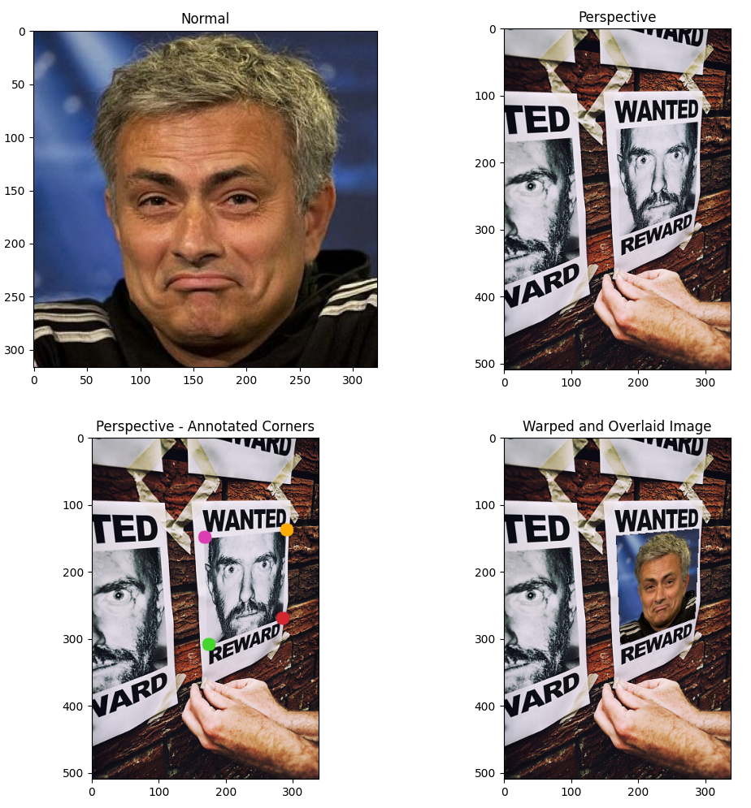 |

2. **Brief description of your implementation (i.e., the algorithm followed with relevant equations and what annotations were used).**

The overall algorithm can be found in the [overlay_image](q3.py#L17) function.

Algorithm:

- Find 4 pairs of point correspondences using manual annotations.
- Need to compute $\mathbf{H}$ such that $\mathbf{x}^` = \mathbf{H} \mathbf{x}$
- Construct the required matrix as per Direct Linear Transformation algorithm
    - For a pair of point correspondences, $\begin{bmatrix}x^`_1 \\ x^`_2 \\ 1\end{bmatrix} = \begin{bmatrix}h_1 & h_2 & h_3 \\ h_4 & h_5 & h_6 \\ h_7 & h_8 & h_9\end{bmatrix}\begin{bmatrix}x_1 \\ x_2 \\ 1\end{bmatrix}$
    - On simplification,
    $\begin{bmatrix}x_1 & x_2 & 1 & 0 & 0 & 0 & -x_1^`x_1 & -x^`_1x_2 & -x^`_1 \\ 0 & 0 & 0 & x_1 & x_2 & 1 & -x_2^`x_1 & -x^`_2x_2 & -x^`_2\end{bmatrix}\begin{bmatrix}h_1 \\ h_2 \\ h_3 \\ h_4 \\ h_5 \\ h_6 \\ h_7 \\ h_8 \\ h_9\end{bmatrix} = 0$
- Using the 4 pairs, construct a $(8\times9)$ matrix $A$ and solve the equation $Ah = 0$ by finding the nullspace using SVD.
- Reshape $h$ to get the homography matrix.
- Use this to warp the normal image to the new perspective and combine them to get a composite image.

---
---

## Q4: Bonus 1 (10 points) - Metric Rectification using 5 pairs of perpendicular lines

```bash
python main.py -q 4 -c configs/q4.yaml
```

1. **Input Images and Output Images: Rectified images and intermediate images with color coded annotation that you used. Annotate the lines that were used.**

| Name | Results |
|----- | ------- |
| tiles5 | 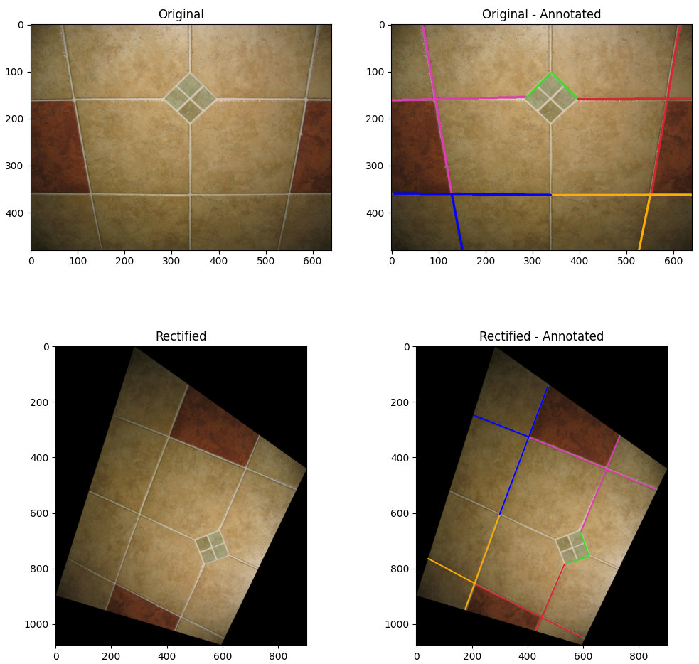 |
| facade | 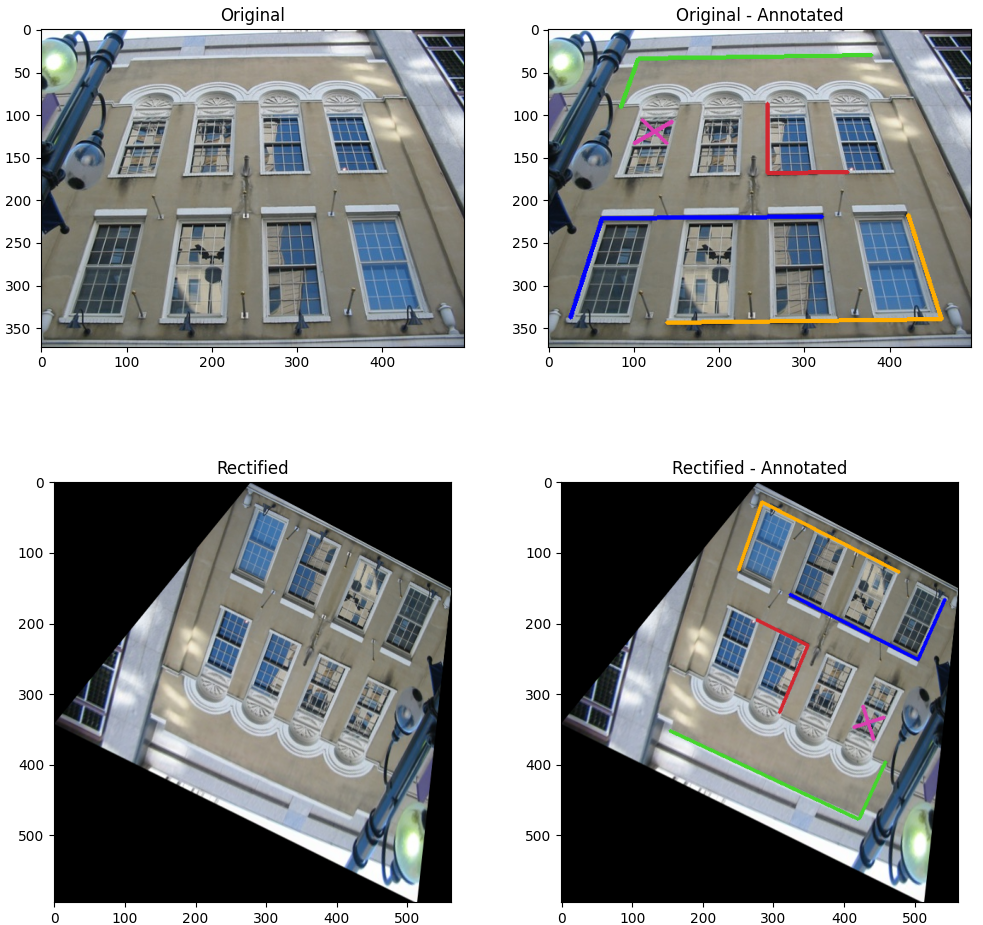 |
| tiles3 | 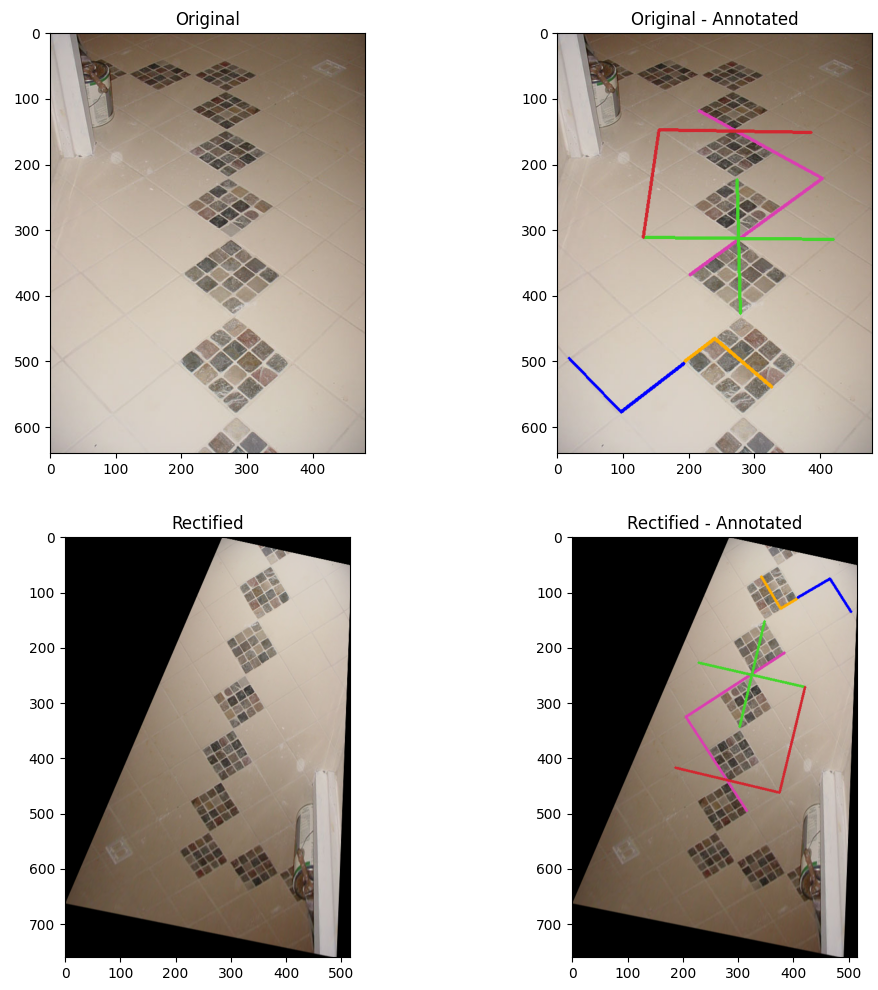 |
| cell |  |
| pacement |  |

2. **Angles (more precisely, the cosines) of at least 3 pairs of perpendicular lines before and after rectification.**

| Name | Before | After | Results |
|----- | ------ | ----- | ------- |
| tiles5 | -0.0633, -0.0178, 0.1851 | 0.00028, 0.00639, 0.0131 | 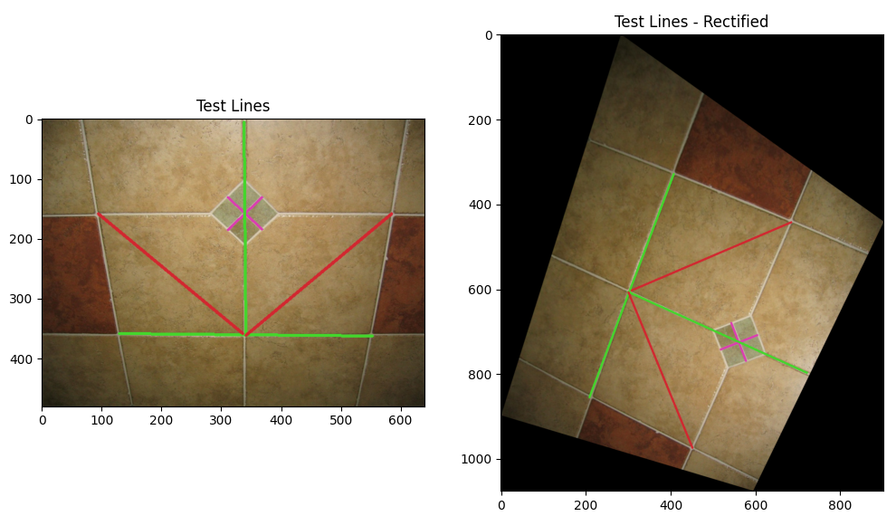 |
| facade | -0.3069, 0.0179, 0.0196 | 0.00137, 0.00091, 0.00027 |  |
| tiles3 | -0.0311, 0.46738, -0.5143 | 0.0016, -0.0042, 0.00000 | 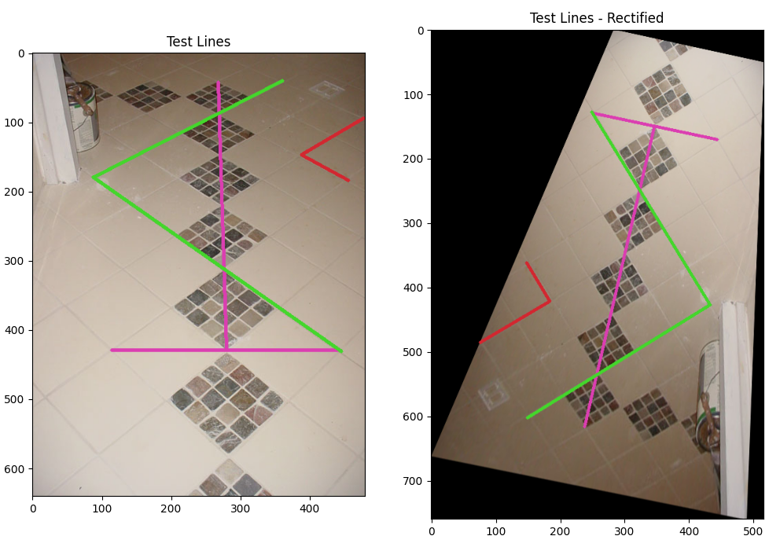 |
| cell | 0.14989, 0.39105, 0.3047 | 0.00096, 0.01819, 0.0161 | 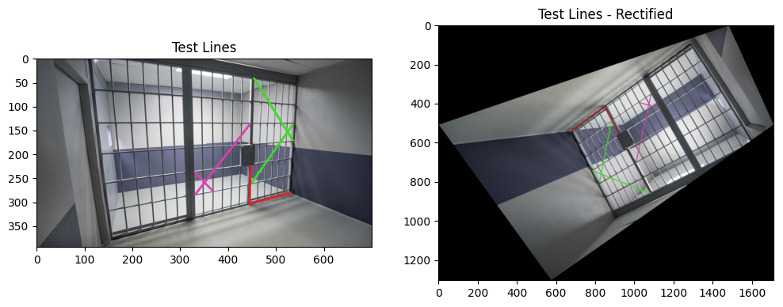 |
| pavement | -0.2902, -0.7477, -0.8504 | -0.0144, -0.0081, -0.0069 | 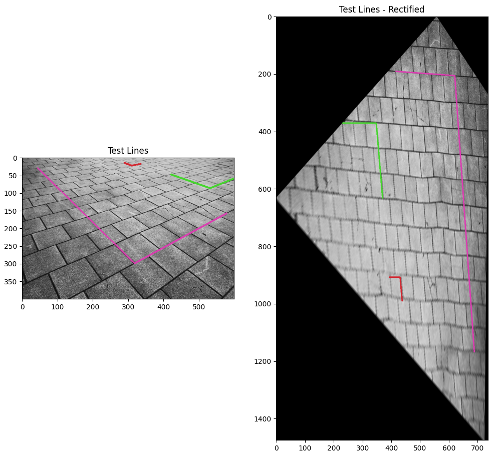 |

3. **Brief description of your implementation.**

The overall algorithm can be found in the [direct_rectify_to_similarity](q4.py#L22) function.

Algorithm:

- Find 5 pairs of originally parallel lines in the image
    - These are found by manually annotating 2 points for each line.
    - The pixel coordinates are then stored and a column of ones is added to move it to $\mathbb{P}^2$ space.
    - The corresponding lines are found by taking the cross product of the points.
- The imaged dual conic at infinity can be defined as $C^{`*}_{\infty} = \begin{bmatrix}a & b/2 & d/2 \\ b/2 & c & e/2 \\ d/2 & e/2 & f\end{bmatrix}$
- Thus, need to find these variables - $a,b,c,d,e,f$
    - $\begin{bmatrix}l_1^` & l_2^` & l_3^`\end{bmatrix}C^{`*}_{\infty}\begin{bmatrix}m_1^` \\ m_2^` \\ m^`_3\end{bmatrix} = 0$
    - $\begin{bmatrix}l_1^`m_1^` & \frac{l_1^`m_2^` + l_2^`m_1^`}{2} & l_2^`m_2^` & \frac{l_1^`m_3^` + l_3^`m_1^`}{2} & \frac{l_3^`m_2^` + l_2^`m_3^`}{2} & l_3^`m_3^`\end{bmatrix}\begin{bmatrix}a \\ b \\ c \\ d \\ e \\ f\end{bmatrix} = 0$
- Using the 5 pairs of perpendicular lines, construct the $(5 \times 6)$ matrix $L$ as shown above.
- Solve the equation $Lc = 0$ by finding the nullspace using SVD.
- Construct $C^{`*}_{\infty}$ and decompose it using SVD as $U \begin{bmatrix}\sigma & 0 \\ 0 & 0\end{bmatrix}U_T$
- Construct the projective transformation matrix $H = U\sqrt{\sigma}$
- Required rectification transformation can be found by inversing this matrix i.e. $H_{-1}$
- Use this to warp the original image back to a similarity.


## Q5: Bonus 2 (10 points) - Creative - Multiple images overlay

```bash
python main.py -q 5 -c configs/q5.yaml
```

1. **Input Images and Output Images.**

| Name | Results |
| ---- | ------- |
| Intermediate - TA1 |  |
| Intermediate - TA2 | 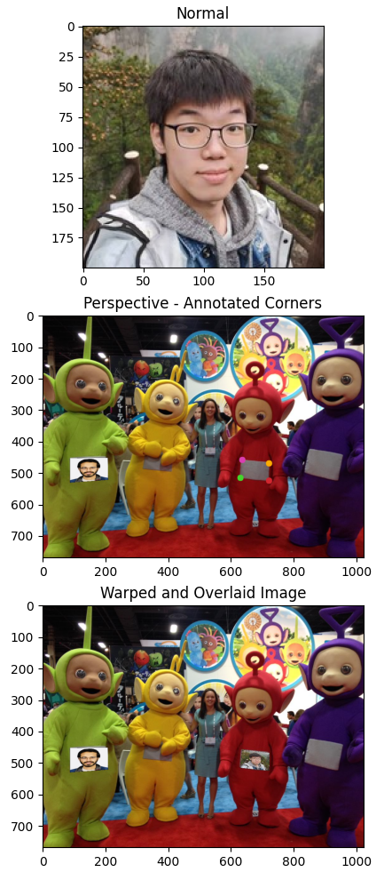 |
| Intermediate - TA3 |  |
| Final | 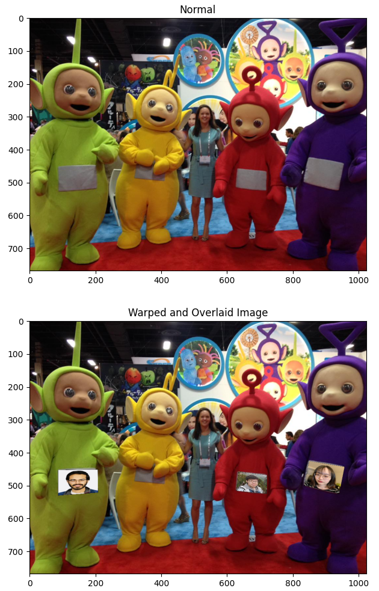 |

:)

2. **Brief description of your implementation.**

The overall algorithm can be found in the [overlay_multiple_images](q5.py#L17)function.

Algorithm:
- The logic is the same as that for q3.
- However, it is done multiple number of times and each time the perspective image is obtained from the previous composite/overlaid image.
