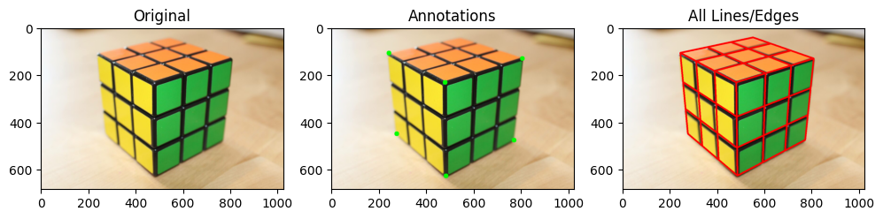
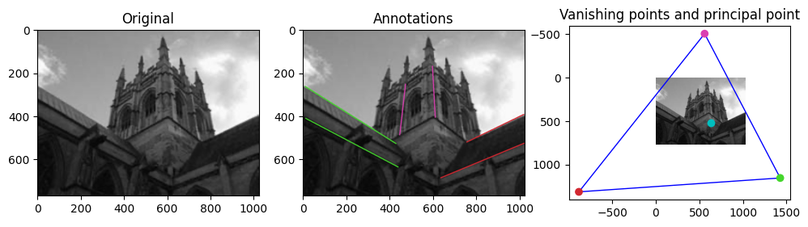
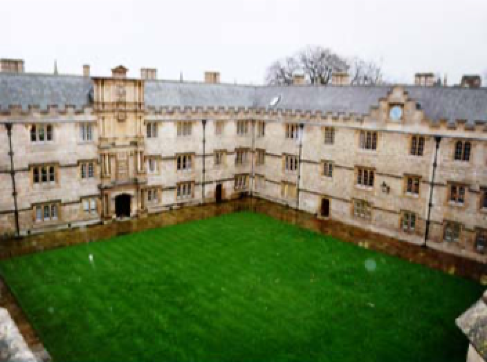
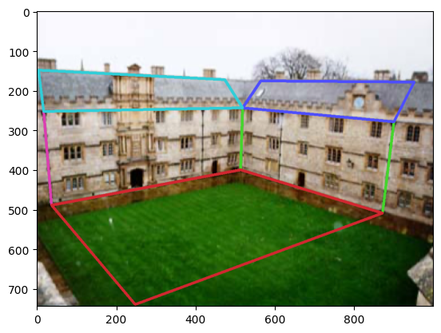

# HW2: Single-view Reconstruction

## Number of late days: 1

# Q1:  Camera matrix `P` from 2D-3D correspondences (30 points)

## (a) Stanford Bunny (15 points)

```bash
python main.py -q q1a -c configs/q1a.yaml -o output/q1
```

  **Matrix P:**

$\begin{bmatrix}
6.43169368e+03 & -2.94843744e+03 & 1.14658061e+03 & 2.22724350e+03 \\
-9.34819249e+02 & -6.75486473e+03 & 2.02949013e+03 & 1.82218778e+03 \\
5.79307220e-01 & -1.42385366e+00 & -7.35268478e-01 & 1.00000000e+00 \\
\end{bmatrix}$


  **Results:**


<br>

---

<br>

## (b) Cuboid (15 points)

```bash
python main.py -q q1b -c configs/q1b.yaml -o output/q1
```

  **Matrix P**

  $\begin{bmatrix}
  6.43169368e+03 & -2.94843744e+03 & 1.14658061e+03 & 2.22724350e+03 \\
  -9.34819249e+02 & -6.75486473e+03 & 2.02949013e+03 & 1.82218778e+03 \\
  5.79307220e-01 & -1.42385366e+00 & -7.35268478e-01 & 1.00000000e+00 \\
  \end{bmatrix}$

  **Results**



<br>

---

<br>

# Q2: Camera calibration `K` from annotations (40 points + 10 points bonus)

```bash
python main.py -q q2a -c configs/q2a.yaml -o output/q2
```


## (a) Camera calibration from vanishing points (20 points)

  **1. Output plots of the vanishing points and the principal point. Also include visualizations of the annotations that you used.**




  **2. Report `K` for the input image.**

  $\begin{bmatrix}
  840.45506444  & 0. & 632.03435507 \\
  0. & 840.45506444 & 523.76873923\\
  0. & 0. & 1. \\
  \end{bmatrix}$

 **3. Brief description of your implementation (i.e., the algorithm followed with relevant equations).**

 - Annotate 3 pairs of parallel lines such that each one is perpendicular to the others.
 - For each pair of parallel lines, say $\mathbf{l}_1$ and $\mathbf{l}_2$, compute the vanishing point - $\mathbf{v} = \mathbf{l}_1\times\mathbf{l}_2$.
- Considering each vanishing point is perpendicular to the others, the cosine of the angle between them is 0.
  - Thus, $\cos(\theta) = \frac{\mathbf{v}_i^T \omega \mathbf{v}_j}{\sqrt{\mathbf{v}_i^T \omega \mathbf{v}_i}\sqrt{\mathbf{v}_j^T \omega \mathbf{v}_j}} = 0$
  - $\therefore \mathbf{v}_i^T \omega \mathbf{v}_j = 0$
  - Here, $\omega = (\mathbf{K}\mathbf{K}^T)^{-1}$ is the image of the absolute conic given by a symmetric matrix $\begin{bmatrix} \omega_1 & \omega_2 & \omega_3 \\ \omega_2 & \omega_4 & \omega_5 \\ \omega_3 & \omega_5 & \omega_6 \end{bmatrix}$
  - Based on the question's assumption of zero skew and square pixels, $ \omega_2 = 0$ and $ \omega_1 = \omega_4$
- Therefore, we have 4 variables with 3 degrees of freedom as scale doesn't matter.
- Each of the 3 pairs of vanishing points gives 1 constraint - $\mathbf{v}^T \omega \mathbf{v}^{'} = 0$ (Also, renaming the $\omega$ variables)
  - $\begin{bmatrix}v_1 & v_2 & v_3 \end{bmatrix} \begin{bmatrix} \omega_1 & 0 & \omega_2 \\ 0 & \omega_1 & \omega_3 \\ \omega_2 & \omega_3 & \omega_4 \end{bmatrix} \begin{bmatrix}v_1^{'} \\ v_2^{'} \\ v_3^{'}  \end{bmatrix} = 0$
  - $\begin{bmatrix}v_{1}\omega_1 + v_{3}\omega_2 & v_{2}\omega_1 + v_{3}\omega_3 & v_{1}\omega_2 + v_{2}\omega_3 + v_{3}\omega_4 \end{bmatrix}\begin{bmatrix}v_1^{'} \\ v_2^{'} \\ v_3^{'}  \end{bmatrix} = 0$
  - $\begin{bmatrix}v_1v_1^{'} + v_2v_2^{'}  & v_3v_1^{'}  + v_1v_3^{'}  & v_3v_2^{'}  + v_2v_3^{'}  & v_3v_3^{'} \end{bmatrix}\begin{bmatrix}\omega_1 \\ \omega_2 \\ \omega_3 \\ \omega_4 \end{bmatrix}  = 0$

- Construct matrix A of shape $(3\times4)$ consisting of the 3 equations like above corresponding to each pair of vanishing points.
- Solve the $A\omega = 0$ using SVD under the constraint that $||\omega|| = 1$
- Construct the matrix $\omega =  \begin{bmatrix} \omega_1 & 0 & \omega_2 \\ 0 & \omega_1 & \omega_3 \\ \omega_2 & \omega_3 & \omega_4 \end{bmatrix}$
- Use Cholesky decomposition $\omega = \mathbf{L}\mathbf{L}^T = (\mathbf{K}\mathbf{K}^T)^{-1}$
- Get the intrinsics matrix: $\mathbf{K} = (\mathbf{L}^{-1})^T$

<br>

---

<br>

## (b) Camera calibration from metric planes  (20 points)

```bash
python main.py -q q2b -c configs/q2b.yaml -o output/q2
```

  **1. Visualizations of annotations that you used.**

  

  **2. Evaluate angles between each pair of planes. This will reflect the correctness of your calibration result.**

  |       | Angle between planes(degree) |
  | ----------- | ----------- |
  | Plane 1 & Plane 2    | 92.51 or 87.49 |
  | Plane 1 & Plane 3    | 102.51 or 77.48 |
  | Plane 2 & Plane 3    | 85.41 or 94.59 |

  **3. Report `K` for the input image.**

  $\begin{bmatrix}
  1.12490319e+03  & 1.02844692e+01 & 5.51902550e+02 \\
  0.00000000e+00 & 1.01632011e+03 & 4.11483623e+02\\
  0.00000000e+00 & 0.00000000e+00 & 1.00000000e+00 \\
  \end{bmatrix}$

  **4. Brief description of your implementation (i.e., the algorithm followed with relevant equations).**

- Get the homographies for the 3 planes using 2D to 2D correspondences
  - Brief algorithm
    - Find 4 pairs of point correspondences using manual annotations.
    - Need to compute $\mathbf{H}$ such that $\mathbf{x}^` = \mathbf{H} \mathbf{x}$
    - Construct the required matrix as per Direct Linear Transformation algorithm
        - For a pair of point correspondences, $\begin{bmatrix}x^`_1 \\ x^`_2 \\ 1\end{bmatrix} = \begin{bmatrix}h_1 & h_2 & h_3 \\ h_4 & h_5 & h_6 \\ h_7 & h_8 & h_9\end{bmatrix}\begin{bmatrix}x_1 \\ x_2 \\ 1\end{bmatrix}$
        - On simplification,
        $\begin{bmatrix}x_1 & x_2 & 1 & 0 & 0 & 0 & -x_1^`x_1 & -x^`_1x_2 & -x^`_1 \\ 0 & 0 & 0 & x_1 & x_2 & 1 & -x_2^`x_1 & -x^`_2x_2 & -x^`_2\end{bmatrix}\begin{bmatrix}h_1 \\ h_2 \\ h_3 \\ h_4 \\ h_5 \\ h_6 \\ h_7 \\ h_8 \\ h_9\end{bmatrix} = 0$
    - Using the 4 pairs, construct a $(8\times9)$ matrix $A$ and solve the equation $Ah = 0$ by finding the nullspace using SVD.
    - Reshape $h$ to get the homography matrix.
- For each homography, $\mathbf{H}_i = \begin{bmatrix}h_1 & h_2 & h_3\end{bmatrix}$, the following 2 constraints hold true
  - Here, $\omega = (\mathbf{K}\mathbf{K}^T)^{-1}$ is the image of the absolute conic given by a symmetric matrix $\begin{bmatrix} \omega_1 & \omega_2 & \omega_3 \\ \omega_2 & \omega_4 & \omega_5 \\ \omega_3 & \omega_5 & \omega_6 \end{bmatrix}$

  - $h_1^T\omega h_2 = 0$
    - This corresponds to the following equation
    - $\begin{bmatrix}c_1 & c_2 + c_4 & c_3 + c_7 & c_5 & c_6 + c_8 & c_9\end{bmatrix}\begin{bmatrix}\omega_1 \\ \omega_2 \\ \omega_3 \\ \omega_4 \\ \omega_5 \\ \omega_6\end{bmatrix} = 0$
    - Here, $\mathbf{C} = \begin{bmatrix} c_1 & c_2 & c_3 \\ c_4 & c_5 & c_6 \\ c_7 & c_8 & c_9 \end{bmatrix}$ is a 3 x 3 matrix created by $h_1h_2^T$


  - $h_1^T\omega h_1 - h_2^T\omega h_2 = 0$
    - This corresponds to the following equation
    - $\begin{bmatrix}c_1 & c_2 + c_4 & c_3 + c_7 & c_5 & c_6 + c_8 & c_9\end{bmatrix}\begin{bmatrix}\omega_1 \\ \omega_2 \\ \omega_3 \\ \omega_4 \\ \omega_5 \\ \omega_6\end{bmatrix} = 0$
    - Here, $\mathbf{C} = \begin{bmatrix} c_1 & c_2 & c_3 \\ c_4 & c_5 & c_6 \\ c_7 & c_8 & c_9 \end{bmatrix}$ is a 3 x 3 matrix created by $h_1h_1^T - h_2h_2^T$

- Construct matrix A of shape $(6\times6)$ consisting of the 6 equations like the ones above - 2 for each square/plane/homography.
- Solve the $A\omega = 0$ using SVD under the constraint that $||\omega|| = 1$
- Construct the matrix $\omega =  \begin{bmatrix} \omega_1 & 0 & \omega_2 \\ 0 & \omega_1 & \omega_3 \\ \omega_2 & \omega_3 & \omega_4 \end{bmatrix}$
- Use Cholesky decomposition $\omega = \mathbf{L}\mathbf{L}^T = (\mathbf{K}\mathbf{K}^T)^{-1}$
- Get the intrinsics matrix: $\mathbf{K} = (\mathbf{L}^{-1})^T$
- For the angles between planes,
  - Compute the unit normals to the plane
    - Find vanishing points using the annotations
    - Find the direction vectors
      - $\mathbf{d}_1 = \mathbf{K}^{-1}\mathbf{v}_1$
      - $\mathbf{d}_2 = \mathbf{K}^{-1}\mathbf{v}_2$
    - Calculate normal $\mathbf{n} = \mathbf{d}_1 \times \mathbf{d}_2$
    - Normalize the normal vector to get a unit vector
  - Angle is given by $\cos^{-1}(\mathbf{n}_i^T\mathbf{n}_j)$

<br>

---

<br>

## (c) Camera calibration from rectangles with known sizes  (10 points bonus)

```bash
python main.py -q q2c -c configs/q2c.yaml -o output/q2
```

  **1. Input image.**

  

  **2. Visualizations of annotations that you used.**

  

  **3. Evaluate angles between each pair of planes. This will reflect the correctness of your calibration result.**

  |       | Angle between planes(degree) |
  | ----------- | ----------- |
  | Plane 1 & Plane 2 | 87.21 or 92.79 |
  | Plane 1 & Plane 3 | 93.11 or 86.89 |
  | Plane 2 & Plane 3 | 112.75 or 67.25 |

  **4. Report `K` for your input image.**

  $\begin{bmatrix}
  805.05588754   & 20.96652265 & 390.5708832 \\
  0. & 716.89468007 & 133.28899322\\
  0. & 0. & 1. \\
  \end{bmatrix}$

  **5. Brief description of your implementation (i.e., the algorithm followed with relevant equations, and in particular emphasizing the differences compared to part b).**

- Get the homographies for the 3 planes using 2D to 2D correspondences
  - Brief algorithm
    - Find 4 pairs of point correspondences using manual annotations.
    - Need to compute $\mathbf{H}$ such that $\mathbf{x}^` = \mathbf{H} \mathbf{x}$
    - Construct the required matrix as per Direct Linear Transformation algorithm
        - For a pair of point correspondences, $\begin{bmatrix}x^`_1 \\ x^`_2 \\ 1\end{bmatrix} = \begin{bmatrix}h_1 & h_2 & h_3 \\ h_4 & h_5 & h_6 \\ h_7 & h_8 & h_9\end{bmatrix}\begin{bmatrix}x_1 \\ x_2 \\ 1\end{bmatrix}$
        - On simplification,
        $\begin{bmatrix}x_1 & x_2 & 1 & 0 & 0 & 0 & -x_1^`x_1 & -x^`_1x_2 & -x^`_1 \\ 0 & 0 & 0 & x_1 & x_2 & 1 & -x_2^`x_1 & -x^`_2x_2 & -x^`_2\end{bmatrix}\begin{bmatrix}h_1 \\ h_2 \\ h_3 \\ h_4 \\ h_5 \\ h_6 \\ h_7 \\ h_8 \\ h_9\end{bmatrix} = 0$
    - Using the 4 pairs, construct a $(8\times9)$ matrix $A$ and solve the equation $Ah = 0$ by finding the nullspace using SVD.
    - Reshape $h$ to get the homography matrix.
- For each homography, $\mathbf{H}_i = \begin{bmatrix}h_1 & h_2 & h_3\end{bmatrix}$, the following 2 constraints hold true
  - Here, $\omega = (\mathbf{K}\mathbf{K}^T)^{-1}$ is the image of the absolute conic given by a symmetric matrix $\begin{bmatrix} \omega_1 & \omega_2 & \omega_3 \\ \omega_2 & \omega_4 & \omega_5 \\ \omega_3 & \omega_5 & \omega_6 \end{bmatrix}$

  - $h_1^T\omega h_2 = 0$
    - This corresponds to the following equation
    - $\begin{bmatrix}c_1 & c_2 + c_4 & c_3 + c_7 & c_5 & c_6 + c_8 & c_9\end{bmatrix}\begin{bmatrix}\omega_1 \\ \omega_2 \\ \omega_3 \\ \omega_4 \\ \omega_5 \\ \omega_6\end{bmatrix} = 0$
    - Here, $\mathbf{C} = \begin{bmatrix} c_1 & c_2 & c_3 \\ c_4 & c_5 & c_6 \\ c_7 & c_8 & c_9 \end{bmatrix}$ is a 3 x 3 matrix created by $h_1h_2^T$


  - $h_1^T\omega h_1 - h_2^T\omega h_2 = 0$
    - This corresponds to the following equation
    - $\begin{bmatrix}c_1 & c_2 + c_4 & c_3 + c_7 & c_5 & c_6 + c_8 & c_9\end{bmatrix}\begin{bmatrix}\omega_1 \\ \omega_2 \\ \omega_3 \\ \omega_4 \\ \omega_5 \\ \omega_6\end{bmatrix} = 0$
    - Here, $\mathbf{C} = \begin{bmatrix} c_1 & c_2 & c_3 \\ c_4 & c_5 & c_6 \\ c_7 & c_8 & c_9 \end{bmatrix}$ is a 3 x 3 matrix created by $h_1h_1^T - h_2h_2^T$

- Construct matrix A of shape $(6\times6)$ consisting of the 6 equations like the ones above - 2 for each square/plane/homography.
- Solve the $A\omega = 0$ using SVD under the constraint that $||\omega|| = 1$
- Construct the matrix $\omega =  \begin{bmatrix} \omega_1 & 0 & \omega_2 \\ 0 & \omega_1 & \omega_3 \\ \omega_2 & \omega_3 & \omega_4 \end{bmatrix}$
- Use Cholesky decomposition $\omega = \mathbf{L}\mathbf{L}^T = (\mathbf{K}\mathbf{K}^T)^{-1}$
- Get the intrinsics matrix: $\mathbf{K} = (\mathbf{L}^{-1})^T$
- For the angles between planes,
  - Compute the unit normals to the plane
    - Find vanishing points using the annotations
    - Find the direction vectors
      - $\mathbf{d}_1 = \mathbf{K}^{-1}\mathbf{v}_1$
      - $\mathbf{d}_2 = \mathbf{K}^{-1}\mathbf{v}_2$
    - Calculate normal $\mathbf{n} = \mathbf{d}_1 \times \mathbf{d}_2$
    - Normalize the normal vector to get a unit vector
  - Angle is given by $\cos^{-1}(\mathbf{n}_i^T\mathbf{n}_j)$

<br>

---
---

<br>

# Q3: Single View Reconstruction (30 points + 10 points bonus)

```bash
python main.py -q q3 -c configs/q3.yaml -o output/q3
```

  **1. Output reconstruction from at least two different views. Also include visualizations of annotations that you used.**

  |      | Image |
  | ---- | ----- |
  | Input |  |
  | Annotations |  |
  | Planes |  |
  | Reconstructed View 1 |  |
  | Reconstructed View 2 |  |


  **2. Brief description of your implementation (i.e., the algorithm followed with relevant equations).**

- Using the annotations and logic from **question 2a**, find $\mathbf{K}$
- Annotate the 5 planes ange generate their normals
  - Find vanishing points using the annotations
  - Find the direction vectors
    - $\mathbf{d}_1 = \mathbf{K}^{-1}\mathbf{v}_1$
    - $\mathbf{d}_2 = \mathbf{K}^{-1}\mathbf{v}_2$
  - Calculate normal $\mathbf{n} = \mathbf{d}_1 \times \mathbf{d}_2$
  - Normalize the normal vector to get a unit vector
- Figure out what pixels lie in what plane and which pixels don't lie in any of them
  - Create a mask of the original image's height and width, initialized with -1
  - For each plane, use the opencv fillpoly function to populate the pixels within that polygon with the plane's index
  - Thus, at the end you have a single channel image of size (h, w) with values in $\begin{bmatrix}-1 & 0 & 1 & 2 & 3 & 4\end{bmatrix}$
- For each plane,
  - We need to find the equation of that plane. The equation of the plane is given by $\mathbf{n}^T\mathbf{X} + a = 0$. Here, $\mathbf{n}$ is known and $\mathbf{X}$ are the variables. So, $a$ needs to be determined.
    - Annotate an additional point, $\mathbf{x}$ within that plane
    - Get the corresponding backprojection ray using $\mathbf{X} = \lambda\mathbf{P}^+\mathbf{x} = \lambda\mathbf{K}^{-1}\mathbf{x}$. Here, the assumption is that we will always be in the camera coordinate frame. So, the camera center lies at the origin.
    - Now, to figure out lambda, we manually decide a depth for this chosen point.
    - $\therefore \lambda = \frac{\mathbf{depth}}{\sqrt{x^2 + y^2 + z^2}}$
    - Now, get $a = - \lambda * \mathbf{n}^T\mathbf{X}$
  - Once the equation of the plane is known, we need the actual 3D coordinates for each of the pixels lying in that plane. This will be done by finding the point of intersection of the backprojected ray and the plane
    - Get the corresponding backprojection ray using $\mathbf{X} = \lambda\mathbf{K}^{-1}\mathbf{x} = \lambda \begin{bmatrix}X_1 \\ X_2 \\ X_3\end{bmatrix}$
    - Substitute these in the plane equation, $\mathbf{n}^T\mathbf{X} + a = 0$, and get the $\lambda$ by $\lambda = \frac{-a}{\mathbf{n}^T\begin{bmatrix}X_1 \\ X_2 \\ X_3\end{bmatrix}}$
    - Now, get the 3D point  $\mathbf{X} = \lambda \begin{bmatrix}X_1 \\ X_2 \\ X_3\end{bmatrix}$