# HW3: 3D reconstruction

## Number of late days: 3

## Q1: 8-point and 7-point algorithm (40 points)

### (A1) F matrix using 8-point algorithm (15 points)

```bash
# Chair
python main.py -q q1a -c configs/q1a_chair.yaml -o output/q1a

# Teddy
python main.py -q q1a -c configs/q1a_teddy.yaml -o output/q1a
```

1. **Brief explanation of your implementation.**

Algorithm:

- Read the $\mathbf{N}$ pairs of point correspondences.
- Normalize $p_1$ and $p_2$ per correspondence as follows
    - $p_1^{'} = \mathbf{T}_1p_1$ and $p_2^{'} = \mathbf{T}_2p_2$
    - Here $\mathbf{T}_i = \begin{bmatrix}s_i & 0 & - s_i x_{io} \\ 0 & s_i & - s_i y_{io} \\ 0 & 0 & 1 \end{bmatrix}$
        - $(x_{io}, y_{io}) = \frac{1}{\mathbf{N}} \sum{p_i}$
        - $s_i = \frac{\sqrt{2}}{d_{avg}}$
            - $d_{avg} = \frac{1}{\mathbf{N}} \sum{\sqrt{(x_i - x_{io})^2 + (y_i - y_{io})^2}}$
- Construct a $(\mathbf{N}, 9)$ matrix $\mathbf{A}$ as follows
    - For each point correspondence $(p_1, p_2)$ where, say $p_1 = \begin{bmatrix}u \\ v \\ w\end{bmatrix}$ and $p_2 = \begin{bmatrix}u^{'} \\ v^{'} \\ w^{'}\end{bmatrix}$
    - $\therefore \mathbf{A}_i =\begin{bmatrix} u^{'}u & u^{'}v & u^{'}w & v^{'}u & v^{'}v & v^{'}w & w^{'}u & w^{'}v & w^{'}w\end{bmatrix}$
- Construct $\mathbf{F}^{'}$ and project it to rank 2
    - Solve $\mathbf{A}f = 0$ using SVD and get the 9 variable vector $f$
    - Reshape to a $(3, 3)$ matrix say $\mathbf{F}^{'}$
    - Perform SVD on this matrix and set the last singular value to 0 to project it to a rank 2 matrix.
- Transform the fundamental matrix back to pixel space
    - Final fundamental matrix, $\mathbf{F} = \mathbf{T}_2^T \mathbf{F}^{'} \mathbf{T}_1$

2. **Epipolar lines: Show lines from fundamental matrix over the two images.**

| Name | F-matrix visualizations |
| ---- | ----------------------- |
| Chair | 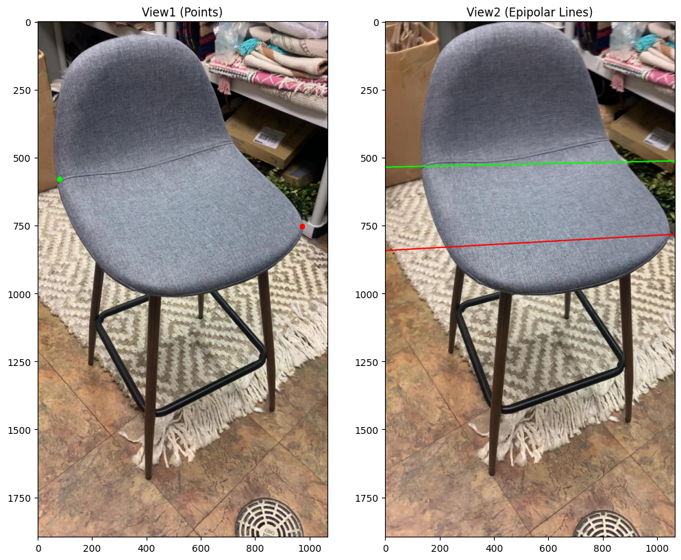 |
| Teddy | 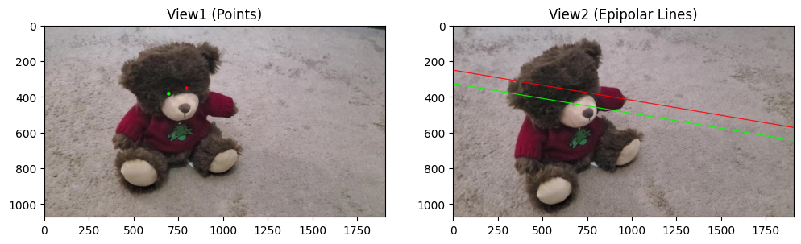 |

**Fundamental Matrices**

- Chair
    - $\begin{bmatrix}1.25682882e-07 & 2.04037806e-06 & -8.18156509e-04 \\ -3.02922310e-06 & 2.93471707e-07 & 1.75381350e-02 \\
-3.68946946e-05 & -1.78325516e-02 & 1.00000000e+00 \end{bmatrix}$
- Teddy
    - $\begin{bmatrix} 1.27285869e-07 & -4.57717590e-08 & 6.67579893e-04 \\
    -4.96411752e-07 & -3.13172764e-07 & -3.96609523e-03 \\
    -1.85248054e-03 & 4.53297156e-03 & 1.00000000e+00\end{bmatrix}$

### (A2) E matrix using 8-point algorithm (5 points)

1. **Brief explanation of your implementation.**

Algorithm

- Given the fundamental matrix $\mathbf{F}$ and intrinsic matrices $\mathbf{K}_1$, $\mathbf{K}_2$, essential matrix can be calculated as follows
    - $\mathbf{E} = \mathbf{K}_2^T \mathbf{F} \mathbf{K}_1$

2. **Provide your estimated `E`.**

- Chair
    - $\begin{bmatrix} 0.1132005 & 1.83773494 & 1.09414997 \\
        -2.72837139 & 0.26432514 & 16.02673254 \\
        -2.72725295 & -16.09946269 & 0.44957711 \end{bmatrix}$
- Teddy
    - $\begin{bmatrix} 0.13499427 & -0.04854369 & 0.79742868 \\
        -0.52647433 & -0.33213843 & -4.66435097 \\
        -1.93860455 & 4.53037473 & -0.02513974\end{bmatrix}$


### (B) 7-point algorithm (20 points)

```bash
# Toybus
python main.py -q q1b -c configs/q1b_toybus.yaml -o output/q1b

# Toytrain
python main.py -q q1b -c configs/q1b_toytrain.yaml -o output/q1b
```

1. **Brief explanation of your implementation.**

Algorithm:

- Read the 7 pairs of point correspondences.
- Normalize $p_1$ and $p_2$ per correspondence as follows
    - $p_1^{'} = \mathbf{T}_1p_1$ and $p_2^{'} = \mathbf{T}_2p_2$
    - Here $\mathbf{T}_i = \begin{bmatrix}s_i & 0 & - s_i x_{io} \\ 0 & s_i & - s_i y_{io} \\ 0 & 0 & 1 \end{bmatrix}$
        - $(x_{io}, y_{io}) = \frac{1}{\mathbf{N}} \sum{p_i}$
        - $s_i = \frac{\sqrt{2}}{d_{avg}}$
            - $d_{avg} = \frac{1}{\mathbf{N}} \sum{\sqrt{(x_i - x_{io})^2 + (y_i - y_{io})^2}}$
- Construct a $(7, 9)$ matrix $\mathbf{A}$ as follows
    - For each point correspondence $(p_1, p_2)$ where, say $p_1 = \begin{bmatrix}u \\ v \\ w\end{bmatrix}$ and $p_2 = \begin{bmatrix}u^{'} \\ v^{'} \\ w^{'}\end{bmatrix}$
    - $\therefore \mathbf{A}_i =\begin{bmatrix} u^{'}u & u^{'}v & u^{'}w & v^{'}u & v^{'}v & v^{'}w & w^{'}u & w^{'}v & w^{'}w\end{bmatrix}$
- Solve $\mathbf{A}f = 0$ using SVD and take the vectors corresponding to the last 2 singular values.
- The family of fundamental matrices is given by the $\lambda$s that solve $det(\lambda\mathbf{F}_1 + (1 - \lambda)\mathbf{F}_2)=0$
    - On solving the above cubic polynomial, there is a possibility of getting more than 1 real root.
    - For each valid $\mathbf{F}$, the overall error is calculated as the distance of correspondence points from the epipolar lines.
    - The one with the minimum error is considered the best solution.
- Transform the fundamental matrix back to pixel space
    - Final fundamental matrix, $\mathbf{F} = \mathbf{T}_2^T \mathbf{F}^{'} \mathbf{T}_1$

2. **Epipolar lines: Similar to the above, you need to show lines from fundamental matrix over the two images.**


| Name | F-matrix visualizations |
| ---- | ----------------------- |
| Toybus | 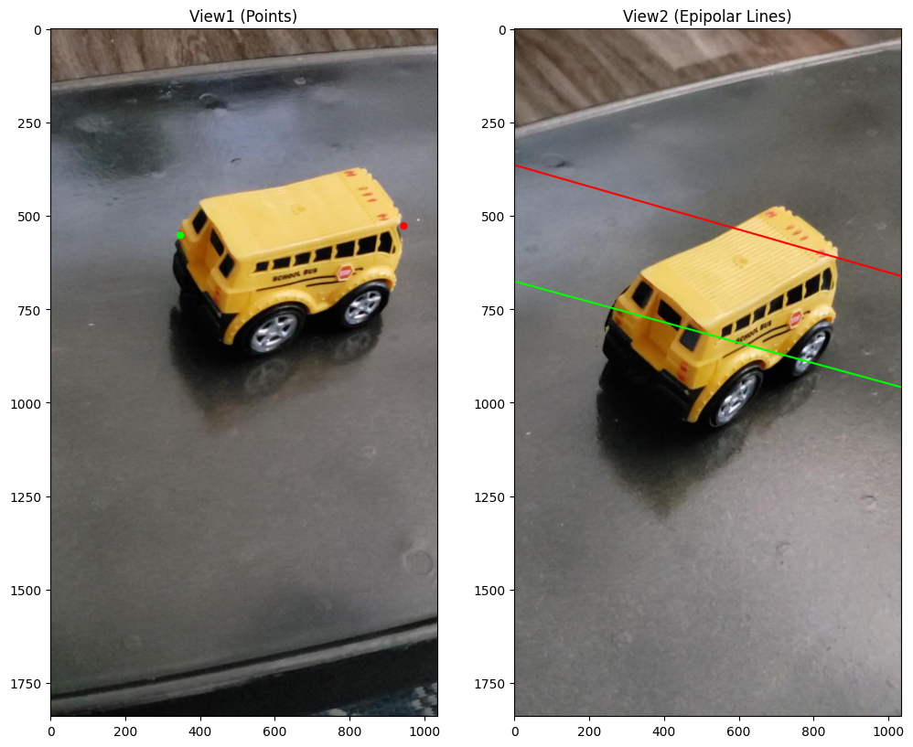 |
| Toytrain |  |

**Fundamental Matrices**

- Toybus
    - $\begin{bmatrix} 2.46880962e-08 & -5.95982379e-07 & 9.63187948e-04 \\
    8.83680434e-08 & 1.69806057e-06 & -3.31485469e-03 \\
    -1.15390742e-03 & 1.78368743e-03 & 1.00000000e+00 \end{bmatrix}$
- Teddy
    - $\begin{bmatrix} -1.30447307e-07 & 3.15712899e-06 & -1.72784408e-03 \\
        -9.36703950e-07 & 7.99558408e-07 & -2.72350527e-03 \\
        5.39072809e-04 & 8.21295355e-04 & 1.00000000e+00 \\\end{bmatrix}$

## Q2: RANSAC with 7-point and 8-point algorithm (30 points)

```bash
# 8 point algorithm with Chair and Teddy.
python main.py -q q2 -c configs/q2_8point.yaml -o output/q2

# 7 point algorithm with Toybus and Toytrain.
python main.py -q q2 -c configs/q2_7point.yaml -o output/q2
```

1. **Brief explanation of your RANSAC implementation and criteria for considering inliers.**

Algorithm

- Choose the number of iterations to run
- For each iteration,
    - Choose the required number of correspondences randomly from the total correspondences
    - Compute $\mathbf{F}$ candidate using 8-point or 7-point algorithm described in the answers to the previous questions.
    - Compute the error per correspondence
        - Consider a correspondence pair $(p_1, p_2)$
        - Compute the corresponding epipolar lines as follows
            - $l_1 = \mathbf{F}_i p_1$ and $l_2 = \mathbf{F}_i^T p_2$
        - The total error is calculated as the sum of distance between $p_2$ and $l_1$, and that between $p_1$ and $l_2$
    - Find the total number of inliers based on a chosen error threshold.
    - Keep track of the best F candidate and inliers.
- Compute the final $\mathbf{F}$ based on the inliers

2. **Report your best solution and plot the epipolar lines -- show lines from fundamental matrix that you calculate over the inliers.**

| Name | Algorithm | F-matrix visualizations |
| ---- | --------- | ----------------------- |
| Chair | 8-Point | 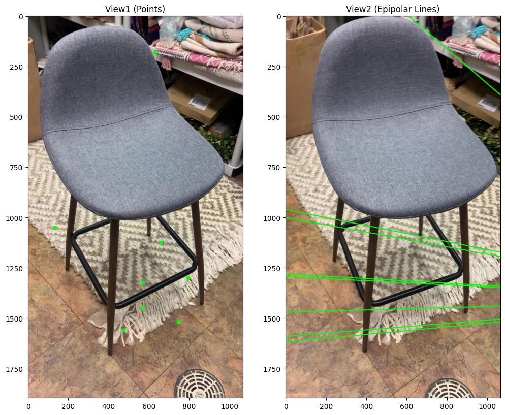 |
| Teddy | 8-Point |  |
| Toybus | 8-Point |  |
| Toytrain | 8-Point |  |
| Chair | 7-Point | 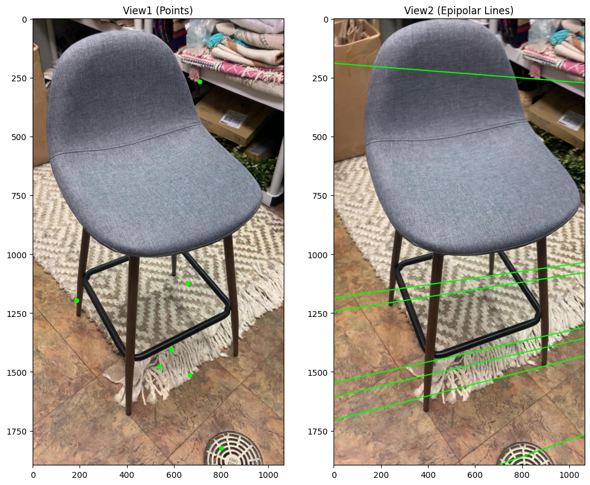 |
| Teddy | 7-Point |  |
| Toybus | 7-Point |  |
| Toytrain | 7-Point | 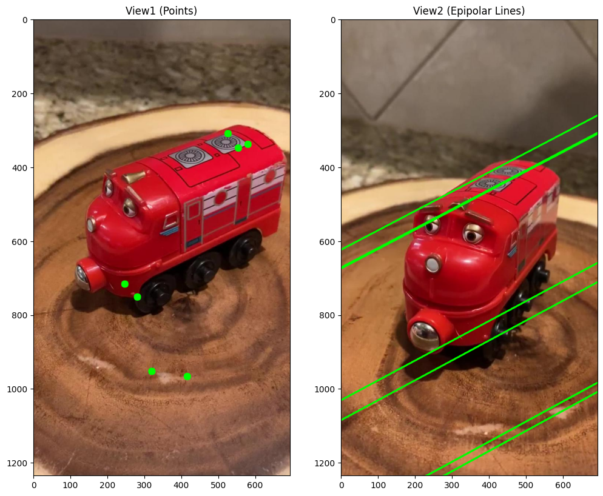 |

**Fundamental Matrices**

- 8 Point
    - Chair
        - $\begin{bmatrix}-7.18894578e-08 & 5.38304501e-07 & -2.89960408e-05 \\
        -1.30801839e-06 & -3.09578196e-07 & -5.28689590e-03 \\
        -5.31852221e-04 & 6.56088403e-03 & 1.00000000e+00\end{bmatrix}$
    - Teddy
        - $\begin{bmatrix}-7.04045827e-06 & 8.66325989e-07 & -1.54530794e-02 \\
        -1.24179808e-05 & 4.88189017e-06 & -3.09669649e-02 \\
        1.97416840e-02 & 3.58302003e-02 & 1.00000000e+00\end{bmatrix}$
    - Toybus
        - $\begin{bmatrix}4.42412336e-08 & 4.81385960e-09 & 3.26114945e-04] \\
        -6.83630808e-07 & 1.56293249e-07 & -4.71728030e-03 \\
        -8.73510794e-04 & 5.23478941e-03 & 1.00000000e+00\end{bmatrix}$
    - Toytrain
        - $\begin{bmatrix}-4.46442899e-06 & 1.39130166e-06 & -1.03695611e-02 \\
        -8.36163905e-06 & 3.37742993e-06 & -2.02417847e-02 \\
        1.26250020e-02 & 2.27129959e-02 & 1.00000000e+00\end{bmatrix}$
- 7 Point
    - Chair
        - $\begin{bmatrix}3.10971723e-07 & 3.63738648e-06 & -2.67069158e-03 \\
        -4.03495739e-06 & 4.84944768e-07 & 8.91309547e-03 \\
        1.91022692e-03 & -9.89852078e-03 & 1.00000000e+00
\end{bmatrix}$
    - Teddy
        - $\begin{bmatrix}-8.18796582e-08 & 8.88807026e-07 & 6.23447152e-04 \\
        -1.58024871e-06 & -8.33102864e-07 & -4.19379447e-03 \\
        -1.81007835e-03 & 5.47921813e-03 & 1.00000000e+00\end{bmatrix}$
    - Toybus
        - $\begin{bmatrix}2.97305851e-07 & 2.42976071e-06 & -3.57687609e-03 \\
        -2.62309020e-06 & 2.91719146e-07 & 5.34487578e-03 \\
        2.97640681e-03 & -6.18726042e-03 & 1.00000000e+00\end{bmatrix}$
    - Toytrain
        - $\begin{bmatrix}-3.09767573e-10 & 4.88982010e-07 & 6.16673448e-04 \\
        -1.10213040e-06 & -6.20750307e-07 & -4.09325410e-03 \\
        -1.80081057e-03 & 5.07272936e-03 & 1.00000000e+00\end{bmatrix}$

3. **Visualization (graph plot) of % of inliers vs. # of RANSAC iterations (see the example below). You should report such plots for both, the 7-pt and 8-pt Algorithms in the inner loop of RANSAC.**

| Name | Algorithm | % of inliers vs. # of RANSAC iterations |
| ---- | --------- | ----------------------- |
| Chair | 8-Point |  |
| Teddy | 8-Point |  |
| Toybus | 8-Point |  |
| Toytrain | 8-Point |  |
| Chair | 7-Point | 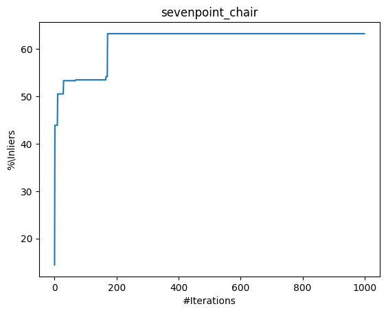 |
| Teddy | 7-Point | 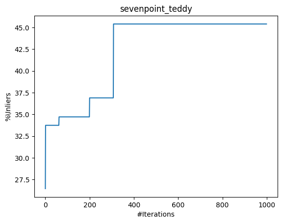 |
| Toybus | 7-Point |  |
| Toytrain | 7-Point | 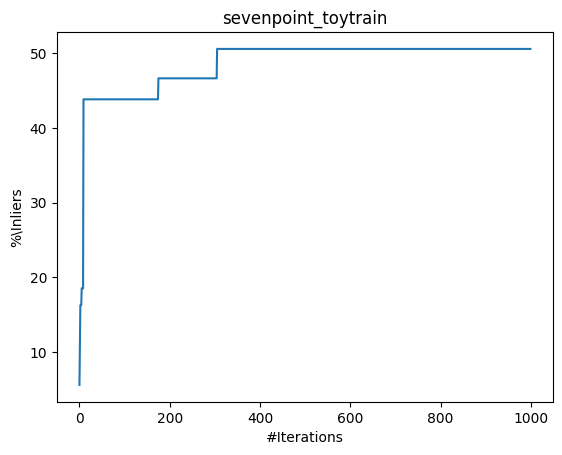 |

## Q3: Triangulation (30 points)

```bash
python main.py -q q3 -c configs/q3.yaml -o output/q3
```

1. **Brief explanation of your implementation.**

Algorithm

- Given $\mathbf{P}_1$, $\mathbf{P}_2$ and $(p_1, p_2)$ pairs, for each pair of correspondences
    - Construct a $(6, 4)$ matrix $\mathbf{A}$ as follows
        - $\mathbf{A} = \begin{bmatrix} [p_1]_{\mathbf{x}}\mathbf{P}_1 \\ [p_2]_{\mathbf{x}}\mathbf{P}_2 \end{bmatrix}$
    - Solve $\mathbf{Ax}=0$ using SVD

2. **Results**

| Name | Image |
| ---- | ----- |
| Correspondences |  |
| Point Cloud | 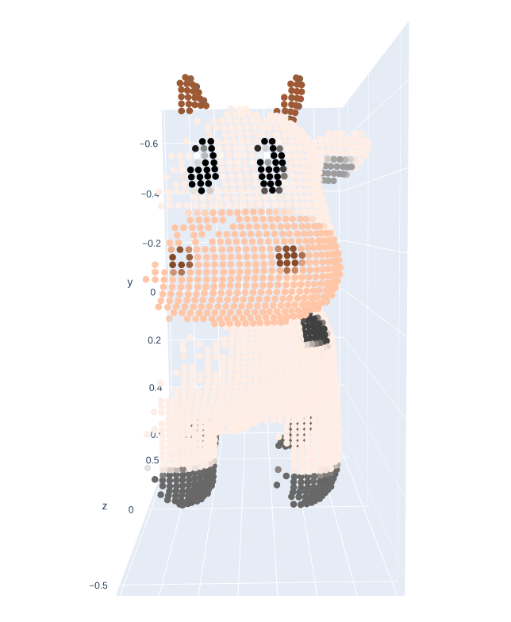 |

## Q4: Bonus 1 - Bundle Adjustment (10 points)

```bash
python main.py -q q4 -c configs/q4.yaml -o output/q4
```

1. **Brief explanation of your implementation.**

Algorithm:

- More accurate projection matrices are found by optimizing the reprojection errors of the 3D points back onto the image planes.
- Per every optimization iteration,
    - The current projection matrices and correspondences pairs are used to triangulate the 3D points in space using the algorithm described in q3.
    - These points are then reprojected back onto the image plane and the reprojection residual are computed.
- Using library functions such as scipy.optimize.least_squares, the above optimization problem is solved to get the better projection matrices.

2. **A colored point cloud before and after bundle adjustment:**

    2D Correspondences | Before Bundle Adjustment  | After Bundle Adjustment |
    | -----------  | ----------| ---------- |
    |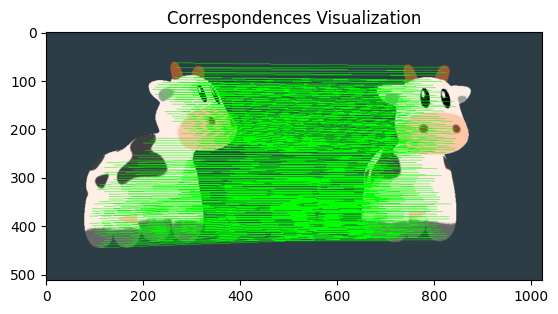  | 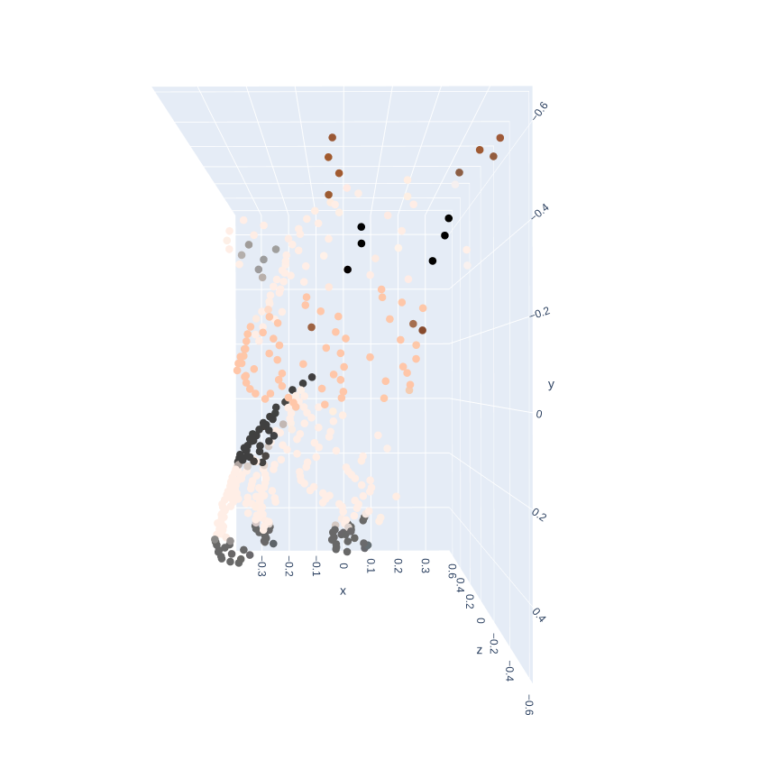 | |
    |  |  | 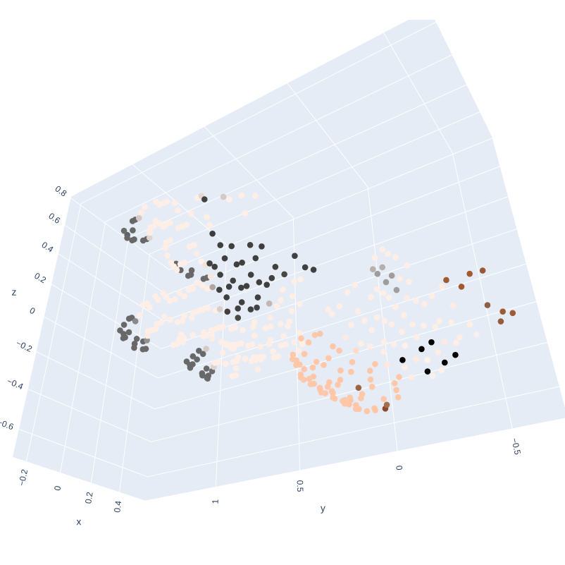

## Q5: Bonus 2 - Fundamental matrix estimation on your own images. (10 points)

```bash
python main.py -q q5 -c configs/q5.yaml -o output/q5
```

1. **Brief explanation of your implementation.**

Algorithm:

- Generated correspondences
    - Using SIFT feature descriptors, found the closest match in the other image and collected them as correspondences.
- Running the same algorithm as q1a on custom images.

2. **Epipolar lines.**


