# HW4: Structure from Motion

## Number of late days: 3

## Q1: Baseline Reconstruction (20 points)

```bash
python main.py -q q1 -c configs/q1.yaml -o output/q1
```

1. **Visualization of the 3D reconstruction from at least two views.**

**Answer:**

| View | Image |
| ---  | ------|
| 1 | 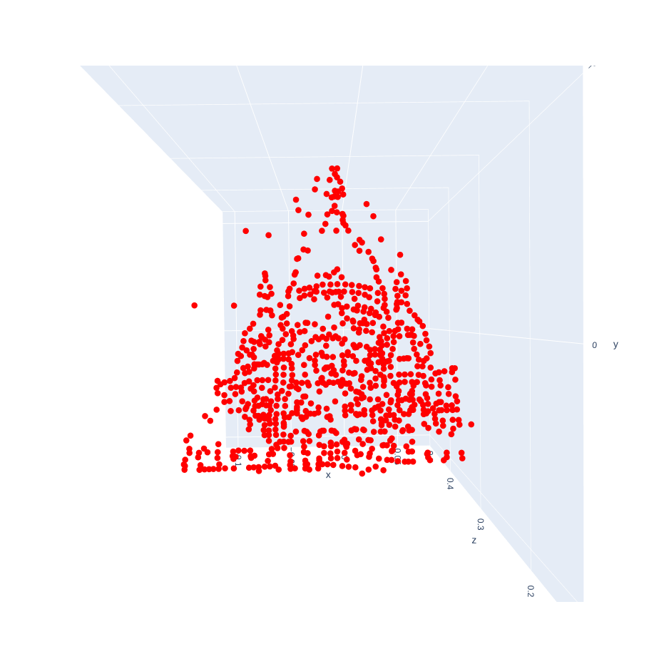 |
| 2 | 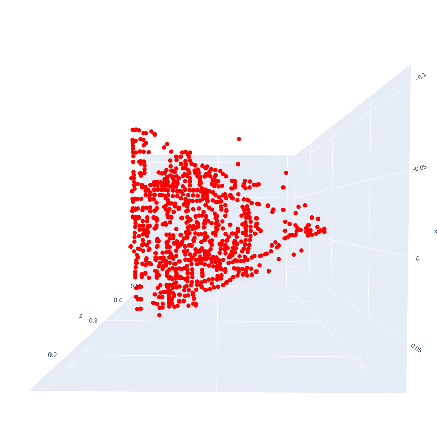 |
| 3 | 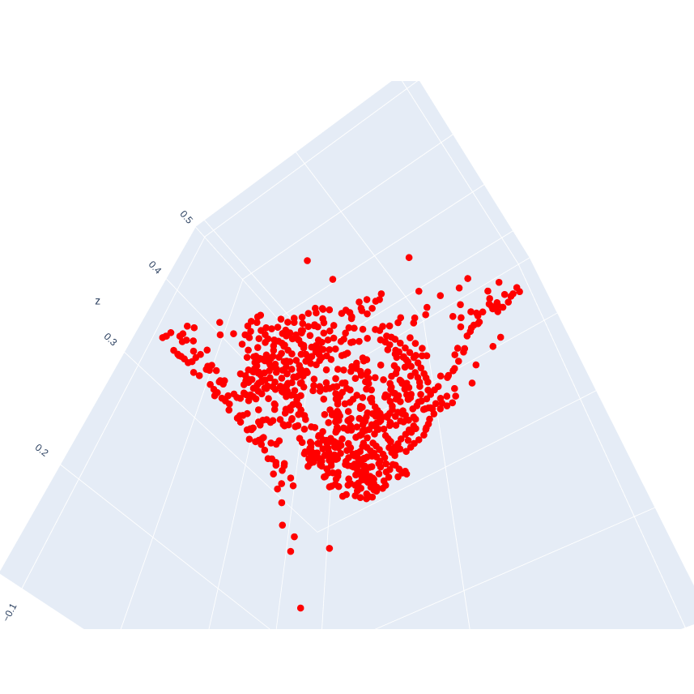 |

2. **Report the extrinsics `R` and `t` of view 2 (which corresponds to `data/monument/img2.jpg`.**

**Answer:**

$\begin{bmatrix}\mathbf{R} & | & \mathbf{t} \end{bmatrix} = \begin{bmatrix}0.99869898 & -0.03566365 & -0.03644781 & | & 0.06324329 \\ 0.02597332 & 0.97085067 & -0.23827371 & | & 0.05322439 \\ -0.04388309 & -0.23701705 & -0.97051388 & | & 0.99657787\end{bmatrix}$

3. **Brief description of your implementation (i.e., the algorithm followed with relevant equations).**

Algorithm:

- Read the $\mathbf{N}$ pairs of point correspondences and the camera intrinsics.
- Compute the essential matrix, $\mathbf{E}$, using the 8-point algorithm
  - Normalize $p_1$ and $p_2$ per correspondence as follows
      - $p_1^{'} = \mathbf{K}^{-1}_1p_1$ and $p_2^{'} = \mathbf{K}^{-1}_2p_2$
  - Construct a $(\mathbf{N}, 9)$ matrix $\mathbf{A}$ as follows
      - For each point correspondence $(p_1, p_2)$ where, say $p_1 = \begin{bmatrix}u \\ v \\ w\end{bmatrix}$ and $p_2 = \begin{bmatrix}u^{'} \\ v^{'} \\ w^{'}\end{bmatrix}$
      - $\therefore \mathbf{A}_i =\begin{bmatrix} u^{'}u & u^{'}v & u^{'}w & v^{'}u & v^{'}v & v^{'}w & w^{'}u & w^{'}v & w^{'}w\end{bmatrix}$
  - Construct $\mathbf{E}$ and project it to rank 2
      - Solve $\mathbf{A}f = 0$ using SVD and get the 9 variable vector $f$
      - Reshape to a $(3, 3)$ matrix say $\mathbf{E}$
      - Get final $\mathbf{E}$ by projecting it to a rank 2 matrix.
        - Perform SVD on this matrix
        - Set the last singular value to 0 and average out the other 2
- Get the projection matrices from $\mathbf{E}$
  - Projection matrices can be calculated as: $\mathbf{P}_1 = \mathbf{K} \begin{bmatrix}\mathbf{I} & | & 0 \end{bmatrix}$ and $\mathbf{P}_1 = \mathbf{K} \begin{bmatrix}\mathbf{R} & | & \mathbf{t} \end{bmatrix}$
  - Thus, need to compute the relative extrinsics
    - $\mathbf{SVD}(\mathbf{E}) = \mathbf{U}\sum\mathbf{V}^T$
    - Then the relative extrinsics are given by
      - $\mathbf{U}\mathbf{W}\mathbf{V}^T | \mathbf{U}_3$
      - $\mathbf{U}\mathbf{W}\mathbf{V}^T | - \mathbf{U}_3$
      - $\mathbf{U}\mathbf{W}^T\mathbf{V}^T | \mathbf{U}_3$
      - $\mathbf{U}\mathbf{W}^T\mathbf{V}^T | - \mathbf{U}_3$
      - Here, $\mathbf{U}_3$ is the hird column and $\mathbf{W} = \begin{bmatrix}0 & -1 & 0 \\ 1 & 0 & 0 \\ 0 & 0 & 1\end{bmatrix}$
    - To find the best solution, for each candidate
      - Compute the projection matrix $\mathbf{P}_2^{'}$ and get 3d points using the 2d correspondence and $\mathbf{P}_1$. This can be done through triangulation.
        - Construct a $(6, 4)$ matrix $\mathbf{A}$ as follows
            - $\mathbf{A} = \begin{bmatrix} [p_1]_{\mathbf{x}}\mathbf{P}_1 \\ [p_2]_{\mathbf{x}}\mathbf{P}_2^{'} \end{bmatrix}$
        - Solve $\mathbf{Ax}=0$ using SVD
      - Considering that the camera centers are known, check how many 3D points are on the other side of the image plane for both cameras.
    - The candidate that maximizes this count is the best solution

## Q2: Incremental Structure-from-Motion (40 points)

```bash
python main.py -q q2 -c configs/q2.yaml -o output/q2
```

1. **After each addition of images, your 3D reconstruction from incremental SfM should look something like as shown below. You need to submit your visualization of the 3D reconstructions at each of the following stages.**

**Answer:**

| Stage | Image |
| ----- | ----- |
| Using Camera #1 and #2 | 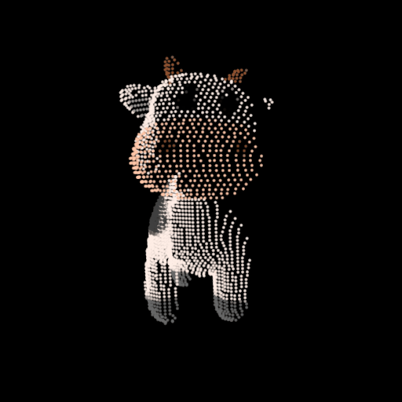 |
| After adding Camera #3 | 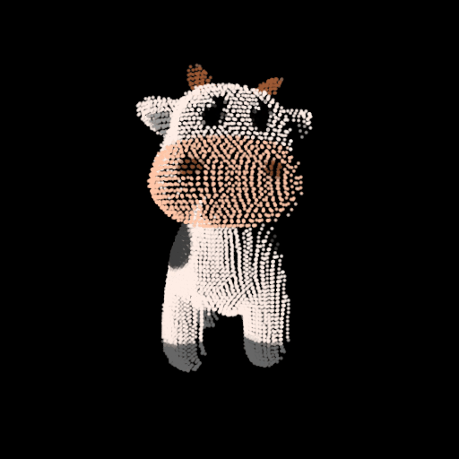 |
| After adding Camera #4 | 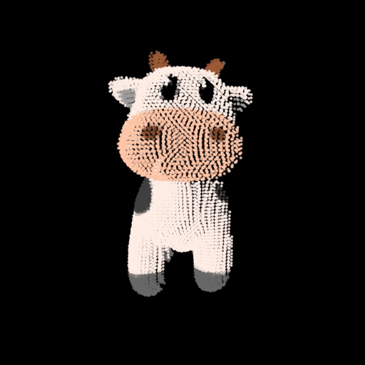 |

2. **Report the extrinsics `R` and `t` of Camera #3 and Camera #4.**

**Answer:**

- Extrinsics for Camera #3:

  $\begin{bmatrix}\mathbf{R} & | & \mathbf{t} \end{bmatrix} = \begin{bmatrix}0.78253345 & -0.00396932 & 0.62259589 & | & -2.0507225 \\ -0.06899776 & 0.99326738 & 0.09305498 & | & -0.1376981 \\ -0.61877355 & -0.11577636 & 0.77699107 & | & 10.14149086\end{bmatrix}$

- Extrinsics for Camera #4:

  $\begin{bmatrix}\mathbf{R} & | & \mathbf{t} \end{bmatrix} = \begin{bmatrix}0.61012912 & -0.01646606 & 0.79213088 & | & 1.14969257 \\ -0.08210936 & 0.99308661 & 0.08388706 & | & -0.31919241 \\ -0.78803586 & -0.1162233 & 0.60455904 & | & 13.65642603\end{bmatrix}$

3. **Brief description of your implementation.**

Algorithm:

- For camera 1 and 2, read the 2d point correspondences and the camera projection matrices.
- Compute the 3D points through triangulation.
- Keep track of these 2D-3D correspondences.
- For each of the next camera pair where 1 of the camera projection matrix is unknown
  - Say, _camera a_ has know projection matrix and _camera b_ has unknown properties.
  - Read the 2D point correspondences between a and b.
  - Of the known 2D-3D correspondences for _camera a_ from previous iterations/triangulation computations, check how many 2D points are present in the _camera a - camera b_ 2D point correspondences.
  - Thus, we now have some 2D-3D correspondences for _camera b_.
  - Compute Projection matrix $\mathbf{P}_b$ using these $\mathbf{N}$ 2D-3D correspondences
    - Construct a $(\mathbf{N} * 2, 12)$ matrix $\mathbf{A}$
    - For each 2D-3D point correpondence $(p_1, P_2)$ where, say $p_1 = \begin{bmatrix}x \\ y \\ 1\end{bmatrix}$ and $p_2 = \begin{bmatrix}X \\ Y \\ Z \\ 1\end{bmatrix}$,
      - $\mathbf{A}_i = \begin{bmatrix} X & Y & Z & 1 & 0 & 0 & 0 & 0 & - xX & - xY & - xZ & - x \\ 0 & 0 & 0 & 0 & X & Y & Z & 1 & - yX & - yY & - yZ & - y\end{bmatrix}$
    - Solve $\mathbf{Ax}=0$ using SVD
  - Once the Projection matrix $\mathbf{P}_b$ is known, compute additional 3D points using the _camera a - camera b_ 2D point correspondences through triangulation.

## Q3: Reconstruct your own scene! (40 points)

### (A) Generate reconstructions (20 points)

1. **Multi-view input images**.

**Answer:**

| Multi-view images | Output |
| ----------------- | ------ |
| 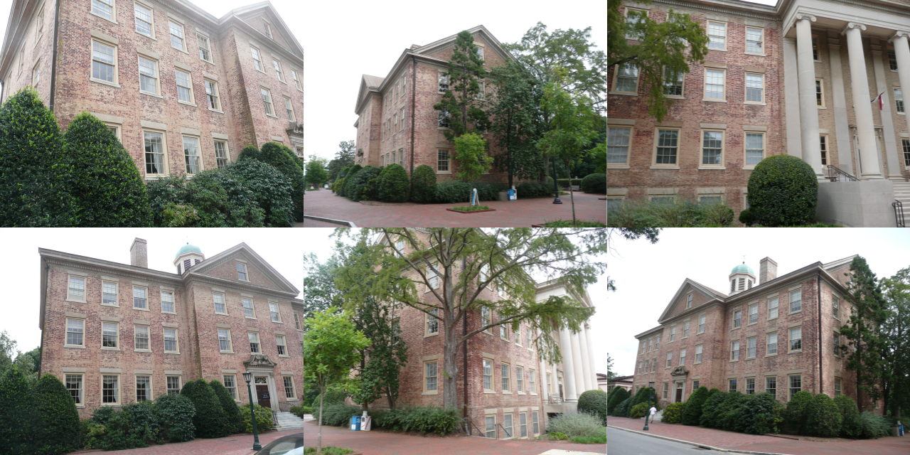 |  |
| 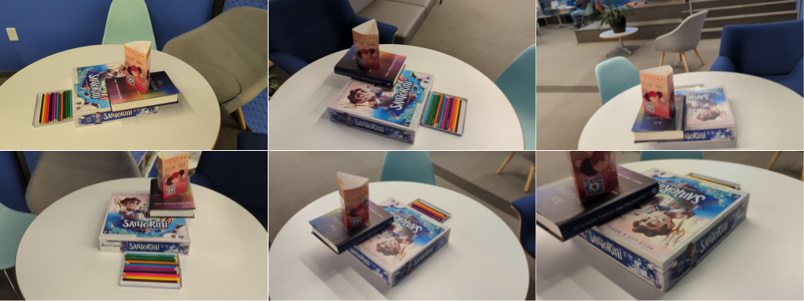 |  |

### (B) Stress test the hyperparameters of COLMAP (20 points)

1. **What happens if we reduce number of input images?**

Input View: 

| #Views | Output |
| ------ | ------ |
| 47 |  |
| 93 |  |
| 140 |  |
| 233 |  |
| 326 |  |

As the number of views increases, the quality of the reconstruction improves. In the example above, the objects of interest have a high number of discernable features. As can be seen in the case with low views, while the reconstruction does capture some information, the finer details are missing and the overall density itself is low. As the number of views increases, the number of feature matches increases and the robustness improves as well.

2. **Under what conditions does COLMAP reconstruction fail?**

| Input View | Output |
| ------ | ------ |
| 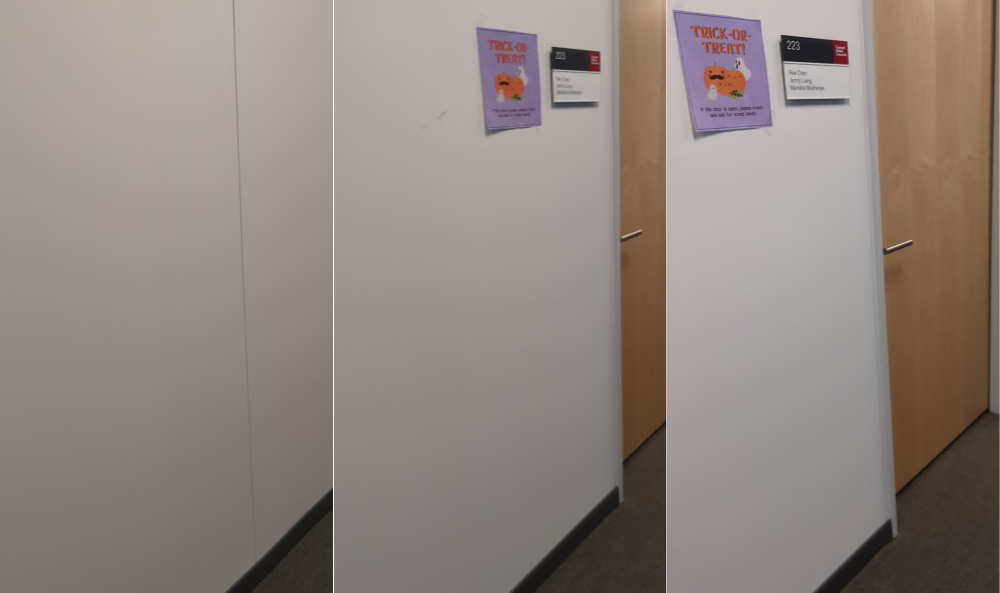 | 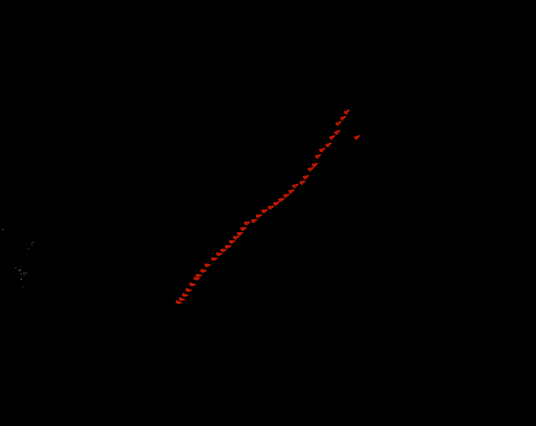 |
| 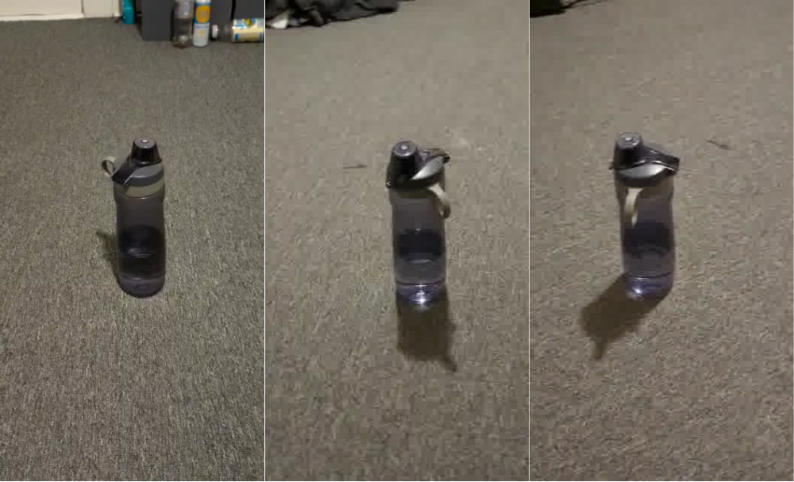 |  |

In scenarios where subsequent views are textureless or have minimal features, COLMAP struggles to converge to a 3d model. Also, in scenarios with transparent surfaces or fluids, the reconstruction suffers. This is mostly because of reflection and how light gets refracted passing through such surfaces. Thus, the camera model on its own doesn't necessarily apply.

COLMAP also throws an error - 'No good initial image pair found'. This shows that it is not able to fit all images into a single model. And then on it's attempt to create another model with remaining frames, it fails.

